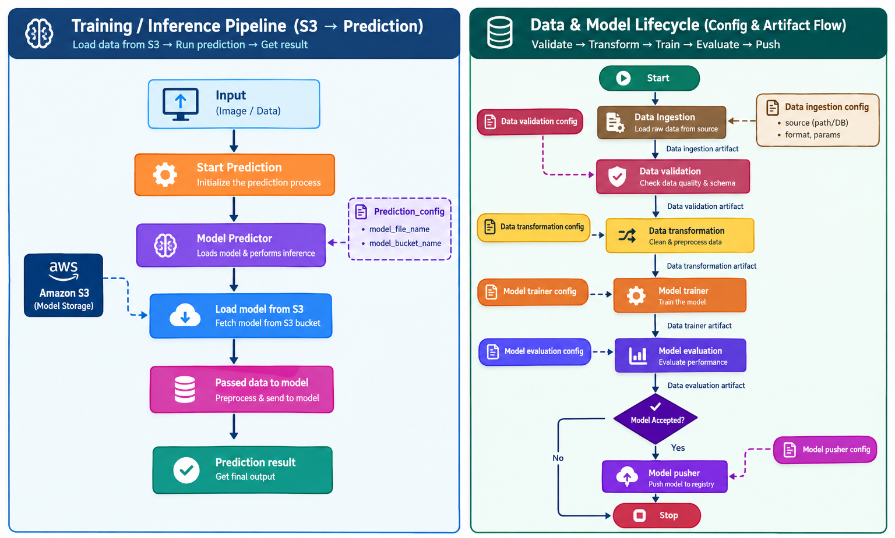

# Spam-Ham Detection

A machine learning app that classifies SMS messages as spam or ham, with a FastAPI interface for training and prediction.

## Project overview

The pipeline cleans and stems messages, then converts them to TF-IDF features (1-2 word n-grams). It tunes `MultinomialNB` and `LinearSVC` with 5-fold cross-validation, optimizing F1. The best candidate is tested on held-out data and promoted only if it meets the configured threshold and improves on the current model.

## Tech stack

Python 3.11, pandas, NumPy, scikit-learn, NLTK, FastAPI, Jinja2, MongoDB, and AWS S3.

## Architecture



## Folder structure

```text
.
├── app.py                     # FastAPI app entry point and routes
├── demo.py                    # Training/demo runner
├── upload_data_mongodb.py     # Upload dataset to MongoDB
├── train_and_export.py        # Model training/export script
├── requirements.txt           # Python dependencies
├── .env                       # Local environment variables (not committed)
├── config/                    # Model and schema configs
│   ├── model.yaml             # Model search configuration
│   ├── prediction_schema.yml  # Prediction schema
│   └── schema.yaml            # Training schema validation
├── src/                       # Main project source code
│   ├── artifact/              # Generated training artifacts
│   ├── cloud_storage/         # AWS/S3 integration
│   ├── components/            # Data ingestion, validation, transformation, training, eval, pusher
│   ├── configuration/         # MongoDB and service config
│   ├── constant/              # Pipeline constants and file names
│   ├── data_access/           # MongoDB data access layer
│   ├── entity/                # Data/config artifact definitions
│   ├── exception/             # Custom exception handling
│   ├── logger/                # Logging setup
│   ├── ml/                    # Model wrapper and preprocessing logic
│   ├── pipeline/              # Training and prediction orchestration
│   └── utils/                 # Shared helper functions
├── static/                    # CSS and UI assets
├── templates/                 # HTML templates for web app
├── notebooks/                 # Jupyter notebooks and experiments
├── artifacts/                 # Saved model/training outputs
├── spamham.csv                # Main dataset
└── README.md                  # Project documentation
```

### Latest training run

Training completed, but the candidate model was not published; the existing model was kept.

- Accuracy: 98.23%
- Precision: 96.85%
- Recall: 94.56%
- F1: 95.69%

These are the candidate model's evaluation metrics and do not describe the currently published model.

This makes the project a good example of an end-to-end machine learning application with a real deployment decision step.

## Demo screenshots


## Setup

### 1) Create and activate virtual environment

```powershell
py -3.11 -m venv myenv
.\myenv\Scripts\Activate.ps1
python -m pip install --upgrade pip
pip install -r requirements.txt
```

### 2) Configure environment variables

Create a `.env` file in the project root with the following keys:

```dotenv
MONGODB_URL_KEY=mongodb+srv://<user>:<password>@<cluster>/
AWS_ACCESS_KEY_ID_ENV_KEY=<aws-access-key-id>
AWS_SECRET_ACCESS_KEY_ENV_KEY=<aws-secret-access-key>
CORS_ORIGINS=http://localhost:3000,http://localhost:8000
```

### 3) MongoDB and AWS requirements

The pipeline expects:

- MongoDB database: `spam_ham_database`
- MongoDB collection: `spam_ham_collection`
- AWS S3 bucket: `spam-detection-model2026`
- AWS region: `us-east-1`

Keep `.env` local and do not commit credentials to version control.

## Training and evaluation metrics

The project logs held-out metrics from the test split, including:

- accuracy
- precision
- recall
- F1 score

## Running the app

Start the web app from the project root:

```powershell
python app.py
```

Then open:

```text
http://127.0.0.1:5001
```

> If port 5001 is already in use, change the port in [src/constant/application.py](src/constant/application.py) to a free value.

## Run with Docker

Make sure Docker Desktop is running and that the root `.env` file is configured as described above. Build the image from the project root:

```powershell
docker build -t spam-ham-detection .
```

Start the app and pass the MongoDB/AWS settings from `.env` into the container:

```powershell
docker run --rm -p 5001:5001 --env-file .env spam-ham-detection
```

Open `http://localhost:5001`. The container starts the FastAPI app with Uvicorn; training and model storage still require access to the configured MongoDB database and AWS S3 bucket. The `.dockerignore` file excludes `.env`, local virtual environments, notebooks, and generated training artifacts from the image.

## API routes

| Method | Route           | Description                                |
| ------ | --------------- | ------------------------------------------ |
| GET    | `/`             | Home page with training status UI          |
| POST   | `/train`        | Starts training in the background          |
| GET    | `/train/status` | Returns current training state and metrics |
| GET    | `/predict`      | Prediction form page                       |
| POST   | `/predict`      | Predicts spam/ham for submitted text       |

## Configuration files

- `config/schema.yaml`: schema validation for training data
- `config/prediction_schema.yml`: prediction input schema
- `config/model.yaml`: model candidates and search grids
- `src/constant/`: project-level constants like column names, buckets, and config defaults
