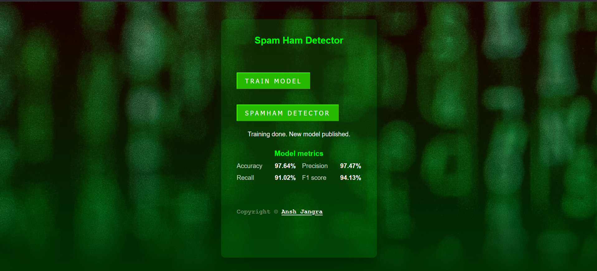

# Spam-Ham Detection

A spam detection project that classifies SMS-like text messages as spam or ham using a machine learning pipeline built with Python, scikit-learn, MongoDB, and AWS S3.

The project includes:

- end-to-end training pipeline
- data validation and transformation
- model selection using cross-validation on F1 score
- model promotion against the existing deployed model
- FastAPI web app for training and prediction

## Project overview

This project reads messages from MongoDB, preprocesses them, vectorizes text, trains multiple classifiers, evaluates the best candidate on a held-out test set, and publishes the model when it improves the current deployed version.

The current pipeline uses:

- TF-IDF vectorization with n-grams
- LinearSVC
- MultinomialNB
- 5-fold cross-validation
- F1 as the optimization metric

## Tech stack

- Python 3.11
- pandas, numpy, scikit-learn
- NLTK-based message preprocessing
- MongoDB for training data storage
- AWS S3 for model storage and deployment comparison
- FastAPI + Jinja2 + static HTML/CSS for the web app

## Architecture


## Folder structure

```text
.
├── app.py                     # FastAPI app entry point and routes
├── demo.py                   # Training/demo runner
├── upload_data_mongodb.py     # Upload dataset to MongoDB
├── train_and_export.py       # Model training/export script
├── requirements.txt          # Python dependencies
├── .env                      # Local environment variables (not committed)
├── config/                   # Model and schema configs
│   ├── model.yaml            # Model search configuration
│   ├── prediction_schema.yml # Prediction schema
│   └── schema.yaml           # Training schema validation
├── src/                      # Main project source code
│   ├── artifact/             # Generated training artifacts
│   ├── cloud_storage/        # AWS/S3 integration
│   ├── components/           # Data ingestion, validation, transformation, training, eval, pusher
│   ├── configuration/       # MongoDB and service config
│   ├── constant/             # Pipeline constants and file names
│   ├── data_access/         # MongoDB data access layer
│   ├── entity/               # Data/config artifact definitions
│   ├── exception/            # Custom exception handling
│   ├── logger/               # Logging setup
│   ├── ml/                   # Model wrapper and preprocessing logic
│   ├── pipeline/             # Training and prediction orchestration
│   └── utils/                # Shared helper functions
├── static/                   # CSS and UI assets
├── templates/                # HTML templates for web app
├── notebooks/                # Jupyter notebooks and experiments
├── artifacts/                # Saved model/training outputs
├── spamham.csv               # Main dataset
└── README.md                 # Project documentation
```

### Verified current metrics

From the latest verified training run:

- Accuracy: 97.64%
- Precision: 97.47%
- Recall: 91.02%
- F1: 94.13%

These are the fresh metrics produced by the current pipeline and are not hard-coded values.

## Setup

### 1) Create and activate virtual environment

```powershell
py -3.11 -m venv myenv
.\myenv\Scripts\Activate.ps1
python -m pip install --upgrade pip
pip install -r requirements.txt
```

### 2) Configure environment variables

Create a `.env` file in the project root with the following keys:

```dotenv
MONGODB_URL_KEY=mongodb+srv://<user>:<password>@<cluster>/
AWS_ACCESS_KEY_ID_ENV_KEY=<aws-access-key-id>
AWS_SECRET_ACCESS_KEY_ENV_KEY=<aws-secret-access-key>
CORS_ORIGINS=http://localhost:3000,http://localhost:8000
```

### 3) MongoDB and AWS requirements

The pipeline expects:

- MongoDB database: `spam_ham_database`
- MongoDB collection: `spam_ham_collection`
- AWS S3 bucket: `spam-detection-model2026`
- AWS region: `us-east-1`

Keep `.env` local and do not commit credentials to version control.

## Data flow

### 1) Load data into MongoDB

```powershell
python upload_data_mongodb.py
```

This uploads the training records into MongoDB so the ingestion layer can read them.

### 2) Run the training pipeline

```powershell
python demo.py
```

Or directly:

```powershell
python -c "from src.pipeline.train_pipeline import TrainPipeline; print(TrainPipeline().run_pipeline())"
```

### 3) Model selection and evaluation

The pipeline:

- reads training data from storage
- validates schema and feature consistency
- applies text preprocessing and TF-IDF vectorization
- tunes candidate models using cross-validation
- selects the best model using F1 score
- compares it against the current deployed model
- publishes only when the new model improves enough to justify replacement

## Training and evaluation metrics

The project logs held-out metrics from the test split, including:

- accuracy
- precision
- recall
- F1 score

## Running the app

Start the web app from the project root:

```powershell
python app.py
```

Then open:

```text
http://127.0.0.1:5001
```

> If port 5001 is already in use, change the port in [src/constant/application.py](src/constant/application.py) to a free value.

## API routes

| Method | Route           | Description                                |
| ------ | --------------- | ------------------------------------------ |
| GET    | `/`             | Home page with training status UI          |
| POST   | `/train`        | Starts training in the background          |
| GET    | `/train/status` | Returns current training state and metrics |
| GET    | `/predict`      | Prediction form page                       |
| POST   | `/predict`      | Predicts spam/ham for submitted text       |

## Configuration files

- `config/schema.yaml`: schema validation for training data
- `config/prediction_schema.yml`: prediction input schema
- `config/model.yaml`: model candidates and search grids
- `src/constant/`: project-level constants like column names, buckets, and config defaults

## Results summary

This project was designed as a practical ML deployment workflow rather than a pure research notebook. The result is a pipeline that can:

- ingest labeled spam/ham data from MongoDB
- validate schema and data quality
- transform raw text into TF-IDF features
- compare candidate models using F1-based cross-validation
- promote the model only when it meaningfully improves the current production version
- serve predictions through a small FastAPI app

### Final verified score

- Accuracy: 97.64%
- Precision: 97.47%
- Recall: 91.02%
- F1: 94.13%

This makes the project a good example of an end-to-end machine learning application with a real deployment decision step.

## Demo screenshots

```text
screenshot/
├── 1.png
└── 2.png
```




## Future improvements

A few improvements I would consider next:

- add model version tracking with timestamped metadata
- store training logs and metrics in MongoDB or a CSV report
- improve the frontend with better status states and metric cards
- add an API response model for cleaner prediction output
- deploy the app with Docker for easier reproducibility
- extend the pipeline with more advanced text features or transformer-based models

## Notes

- The model-promotion logic is designed to keep the current deployed model unless the new candidate shows a meaningful improvement.
- The home page surfaces the current training result and metrics in a simple UI.
- Prediction uses the latest model that has been accepted and stored for production use.

## License

This project is intended for learning, portfolio, and experimental use.
